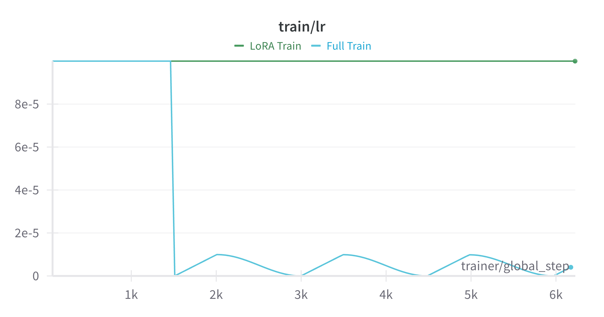
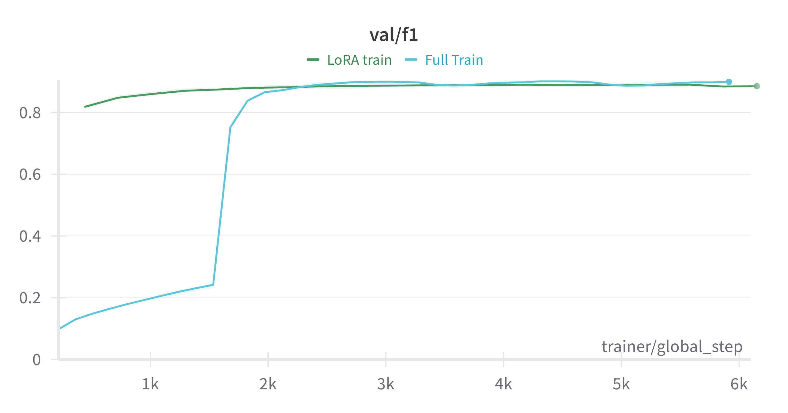
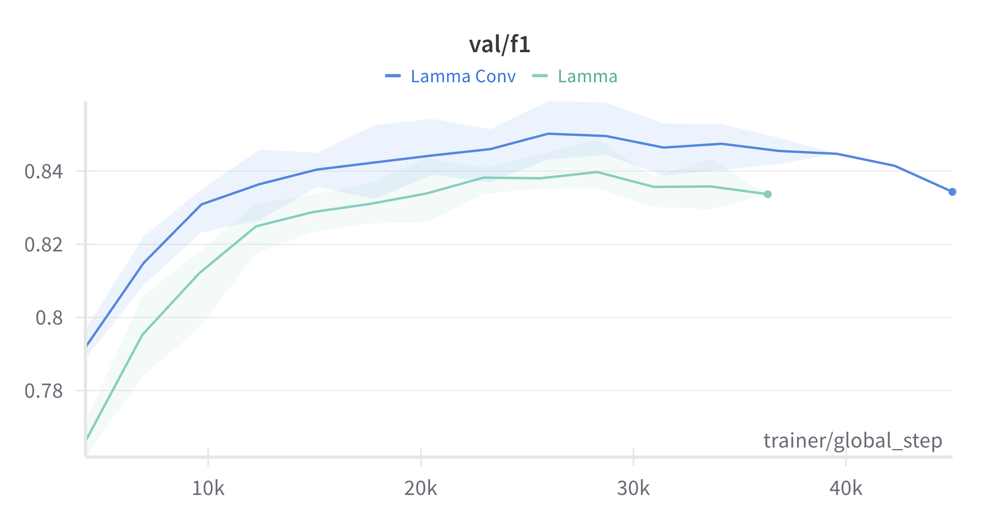
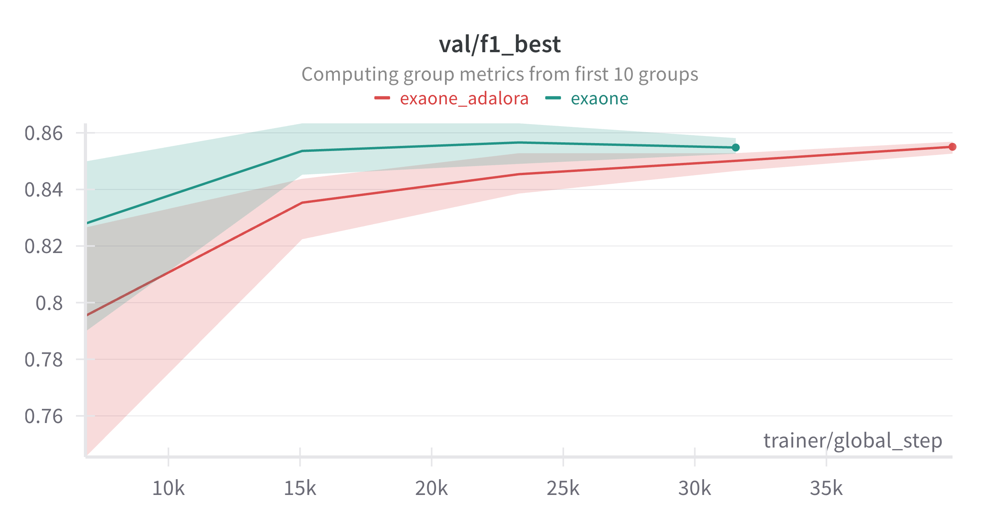

# 한국 경제 기사 분석 및 질의응답

기사(자연어) 분석 및 질의응답은 복잡한 기사에서 중요한 정보를 자동으로 식별하고 추출하는 것으로 중요한 인공지능 기술입니다.

최근 인공지능 기술의 발전으로 활발한 연구가 진행되고 있으며, 실제 서비스에도 적용되고 있습니다.

특히 전문 지식을 요구하는 금융 및 경제 뉴스 기사에 대한 적용은 일반 사용자의 효율성을 높이고 중요한 인사이트를 제공할 수 있습니다.

## Index
* [Competition imformation](#competition-imformation)
* [Data](#data)
* [Model](#model)
* [Result](#result)
* [Code reproduction](#code-reproduction)
***

## Competition imformation

- 주관: 인공지능융한연구센터, BK 산업융합형 차세대 인공지능 혁신인재 교육연구단
- 운영: 데이콘
- 대회 : [link](https://dacon.io/competitions/official/236291/overview/description)
- 대회 기간 : 2024.07.02 ~ 2024.08.14
- 평가 산식 : F1 Score
    
## Data

|type|count|
|:---:|:---:|
|Train : context, question, answer|33716|
|Test : context, question|1507|

- 목표 : context에 대하여 question에 알맞은 answer 제공

## Model

### Roberta

- LoRA Train : PEFT 기법인 LoRA를 활용하여 학습
- Full Train : cosineannealinglr을 커스텀하여 첫번째 epoch에서 마지막 qa_output Layer만 학습하고 사전학습된 weight는 2번째 epoch부터 lr을 낮춰서 함께 학습 

참고 : [scheduler](LightningHydraTemplate/src/models/components/pytorch_cosine_annealing_with_warmup/cosine_annealing_warmup/scheduler.py), [Roberta](LightningHydraTemplate/src/models/components/roberta.py)

### Lamma3

- Lamma - QaOutput : peft 기법인 LoRA를 활용하여 학습
- Lamma Conv - QaOutputV2 : peft 기법인 LoRA를 활용하여 학습 qa_output에 conv연산 추가

참고 : [Lamma3](LightningHydraTemplate/src/models/components/lamma.py)

### exaone

- exaone : peft 기법인 LoRA를 활용하여 학습
- exaone adalora : peft 기법인 adaLoRA를 활용하여 학습

참고 : [exaone](LightningHydraTemplate/src/models/components/exaone.py)

## Result

lamma Conv, exaone ensemble하여 최종 결과 제출

|Type|Public|Private|
| :---: | :---: | :---: |
| ensemble | 0.82616 | 0.82419 |

## Code reproduction

~~~python
# Data Preprocess : LightningHydraTemplate/data/raw_data 경로에 train, test 데이터 폴더 저장
python src/data_cleaning.py
~~~

~~~python
# Model Train
cd LightningHydraTemplate

python src/train.py model=lamma data=lamma trainer=gpu
# or
python src/train.py model=roberta data=roberta trainer=gpu
# or
python src/train.py model=exaone data=exaone trainer=gpu

~~~

~~~python
# Model Inference
python src/eval.py model=exaone data=roberta trainer=gpu ckpt_path="Path"
~~~

~~~python
# ensemble 생성
python src/ensemble.py
~~~
